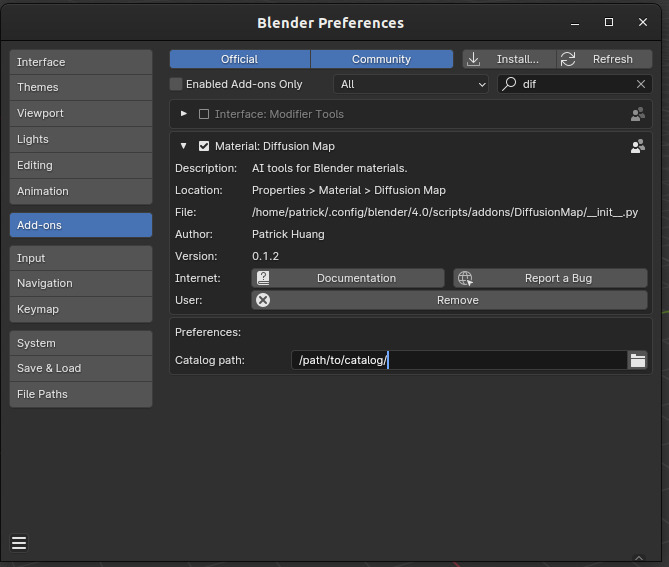
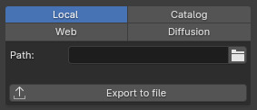

Manual
======

DiffusionMap user manual. All features are documented here.

Catalog
-------

For convenience and efficiency, the program defines a global catalog of assets.

As you import downloaded assets, you have the option to also add them to the
catalog. This builds up a library of assets over time.

Set the catalog path in the user preferences:

Catalog features:

- Load assets from the catalog, without having to download them again.
- Load preview icon in the UI.
- Reference with symlink (instead of copying) to save disk space.

Flow
----

To increase customization freedom, the program defines a **flow of the asset:
The asset comes from a source (e.g. local file), and ends up at some
destinations (e.g. Blender material, local catalog, and global catalog)**.

Source
------

This is where the asset comes from. The asset is a collection of PBR maps, like
color, bump, and roughness.

Select the source type by clicking on the radio buttons on top of the first
group.

Regardless of the source, you can use the **Export to file** operator to copy
the currently selected asset to a specified path.

Local
^^^^^

The asset is a local file (i.e a file on your computer). This can be a directory
or a zip file, where the textures are in the root directory.

Catalog
^^^^^^^

Asset from the global catalog.

Web
^^^

TODO

Texture file names
------------------

Asset names are of the format ``AssetName001_1K``.
